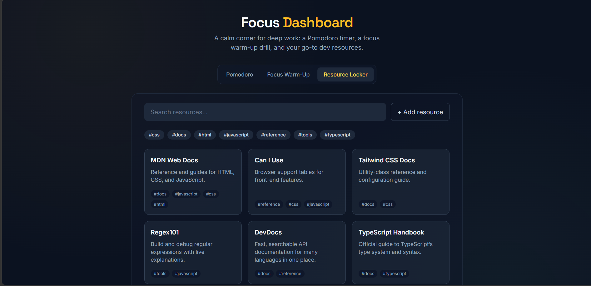

# 🎯 Focus Dashboard

> A distraction-free productivity hub for developers and students — a Pomodoro
> timer, a Schulte Table focus warm-up, and a personal dev-resource locker,
> all in one page.

**[Live Demo →](#)** _(add your deployed link here)_


## ✨ Features

- ⏱️ **Pomodoro Timer** — three built-in presets (25/5, 50/10, 90/20) plus a
  custom interval form, a circular progress ring, a WebAudio alert tone, and
  automatic work → break → work transitions with a session counter.
- 🧠 **Schulte Table Trainer** — a 4×4 / 5×5 / 6×6 shuffled number grid.
  Click 1 through N in order as fast as you can; your best 5 times per grid
  size are saved locally.
- 🔖 **Resource Locker** — a searchable, tag-filterable card grid of go-to dev
  docs and tools. Add your own links; they persist alongside the seeded
  defaults in `localStorage`.

## 🖼️ Screenshots


## 🛠️ Tech Stack

- **Vanilla JavaScript** (ES Modules) — no framework, to keep the DOM and
  state-management code visible and reviewable
- **Tailwind CSS** (via CDN — see [Architecture](#-architecture) for why)
- **Vitest** + **jsdom** for unit tests
- **GitHub Actions** for CI

## 🚀 Getting Started

No build step is required — this project runs as static files.

```bash
git clone https://github.com/geosteam36/focus-dashboard.git
cd focus-dashboard
npm install       # installs test tooling only
npm run dev       # serves the app locally (or just open index.html)
```

Then open the printed local URL (or `index.html` directly) in your browser.

### Running tests

```bash
npm test          # runs the full suite once
npm run test:watch
```

## 📁 Architecture

```
focus-dashboard/
├── index.html                  # app shell: tab bar + panel mounts
├── src/
│   ├── main.js                 # entry point — mounts all modules
│   ├── core/                   # storage, event bus, DOM helpers, constants
│   ├── utils/                  # pure helpers (formatTime, shuffleArray, debounce)
│   ├── components/             # shared UI: Tabs, Toast
│   └── modules/
│       ├── pomodoro/           # timer state machine (pomodoro.js) + UI (pomodoro.ui.js)
│       ├── schulte/            # grid logic (schulteGrid.js) + UI + high scores
│       └── resourceLocker/     # CRUD store + UI + seed data
```

Each module keeps **logic and rendering in separate files** (e.g.
`pomodoro.js` is a plain, DOM-free state machine; `pomodoro.ui.js` is the only
file that touches the page). That split is why the logic files can be unit
tested directly, with no mocking of the DOM required.

`core/storage.js` namespaces every key under `focus-dashboard:*` so this app
won't collide with anything else in `localStorage`. `core/eventBus.js` is a
tiny pub/sub used for cross-module notifications (e.g. the Pomodoro module
firing a toast without importing the Toast component directly).

> **Why Tailwind via CDN instead of a build step?** This keeps the project a
> true zero-install static site — clone it and open `index.html`, no `npm
> install` required to *view* it. If you want a production build (minified,
> tree-shaken CSS), swap the CDN `<script>` tag for a Vite + PostCSS pipeline;
> the file structure here already anticipates that move.

## 🧭 Roadmap

- [x] MVP: functional timer, grid, and resource cards
- [x] LocalStorage persistence across all three tools
- [x] Custom Pomodoro intervals + sound alerts
- [x] Schulte high scores, multiple grid sizes
- [x] Resource search + tag filtering + add/remove
- [x] Unit tests for all core logic (13 tests, Vitest)
- [x] CI via GitHub Actions
- [ ] Keyboard navigation for the Schulte grid (arrow keys + Enter)
- [ ] Browser Notifications API integration for Pomodoro
- [ ] Dark/light theme toggle
- [ ] Optional Vite build pipeline for a minified production bundle

## 🤝 Contributing

Issues and PRs are welcome. This is primarily a portfolio/learning project,
but feedback on architecture or accessibility is especially appreciated.

## 📄 License

MIT — see [LICENSE](LICENSE).
